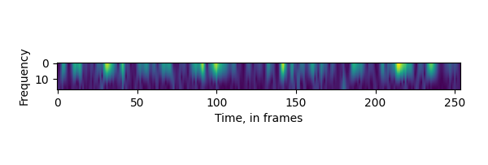

# fft-embeddings
from the time domain to the frequency domain and back again, this time with text embeddings!

## what this repo does:
1. split a large corpus of text into overlapping segments (see `split_utils.split_text()`)
1. transpose the resulting time-domain embeddings (that is, a list of embeddings representing the sequential pieces of text) into the frequency domain with librosa's FFT implementation
1. do some signal processing in the frequency domain to, in principle, boost the signal-to-noise ratio of the embeddings (currently only lowpass filter is supported lmao)
1. transpose back to the time domain with librosa's ISTFT implementation where you can once again do all the classic embeddings-y things like semantic search, classification, etc.

## results

sliced + fft'ed + lowpass'ed + istft'ed embeddings perform better than both openai's embeddings for the whole text and un-lowpass'ed sliced embeddings on the toy classification task in `clf_test.ipynb`:
- get embeddings for whole text: 97.1% accuracy
- sliding window without lowpass filter: 96% accuracy
- sliding window with lowpass filter @ 0.5: **97.6% accuracy**

## a cool visualization

spectrogram for channel 5 of openai's embeddings on the Gettysburg Address:
